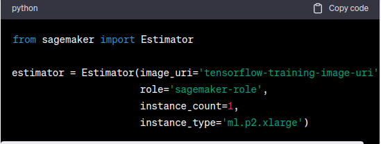
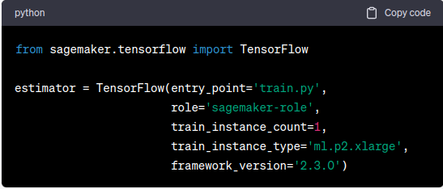

- **Estimator vs Framework Estimator**
    
    ‘sagemaker.estimator.Estimator’와 ‘sagemaker.tensorflow.Tensorflow’는 둘 다 estimator이지만 다른 점이 존재한다. 
    
    1. sagemaker.estimator.Estimator
        1. generic 하게 쓰일 수 있는 estimator class이다. 특정 framework에 한정되지 않고 쓰일 수 있다. 
        2. 중요하게 다른 점은 아래의 코드와 같이 docker image uri를 파라미터 값으로 전달해줘야 한다. docker image는 pre-builit image일 수도 있고, custom image일 수도 있다.
        
         

    2. sagemaker.tensorflow.Tensorflow (다른 framework도 존재하지만 일단 tensorflow를 예시로 들겠다)
        1. 텐서플로우 베이스의 ml 모델을 훈련하기 위한 estimator이다.
        2. framework의 버전이라던가 텐서플로우 관련 default settings 값에 대한 전달이 필요하다. 중요한 점은 아래의 코드와 같이 entry point로 사용될 스크립트를 정의해 주어야 한다. 제공된 도커 이미지를 컨테이너화하는 generic estimator와 달리 tensorflow container 위에 entrypoint로 지정된 스크립트를 주입시킨다.
        
        
