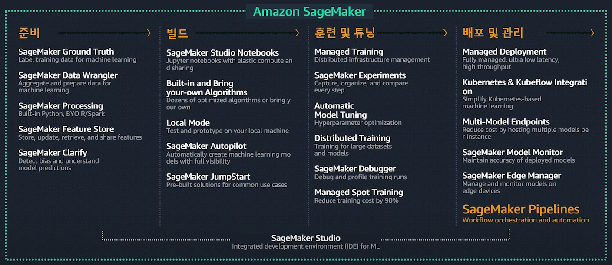

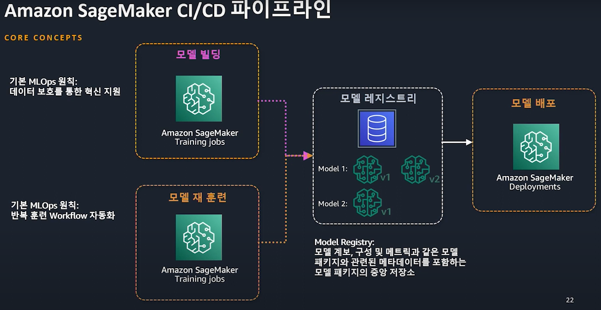

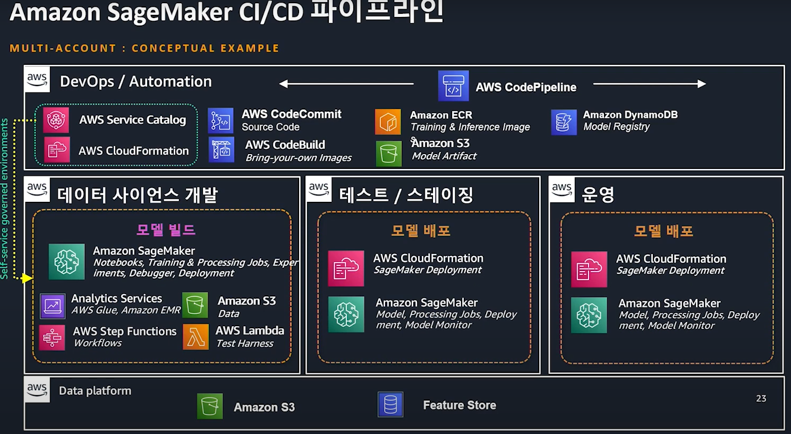

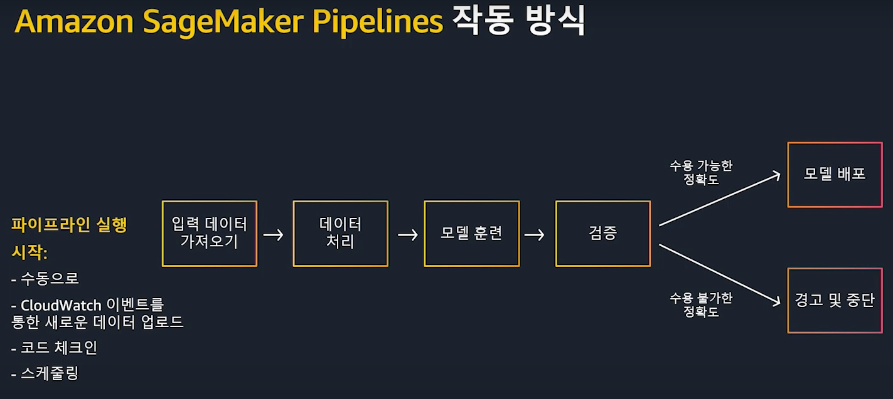

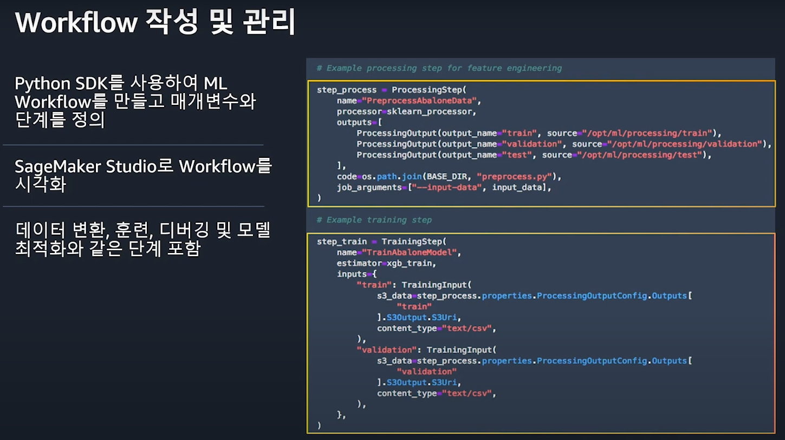

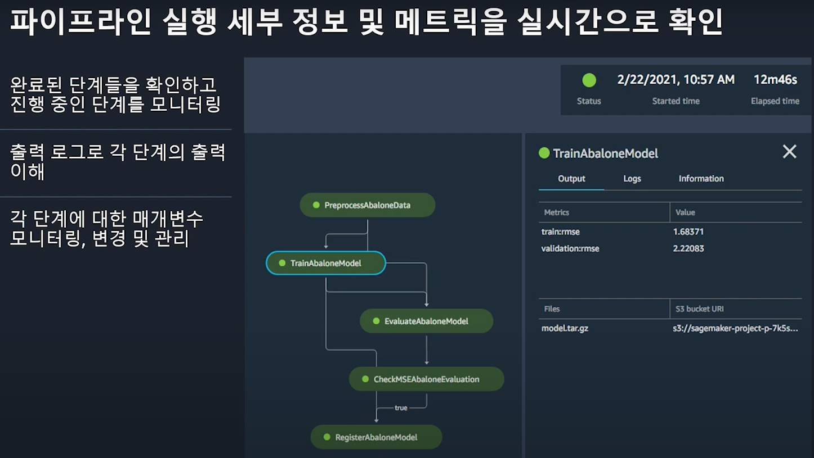

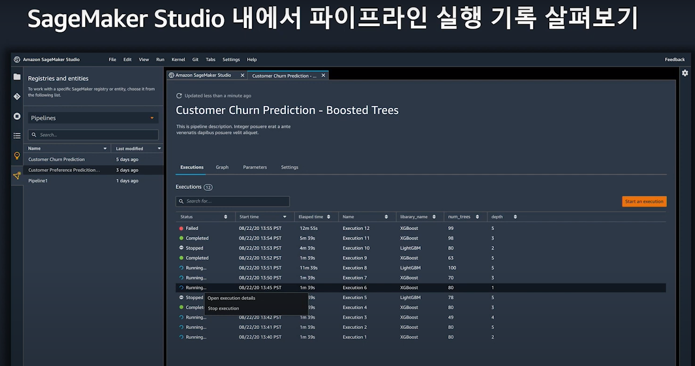

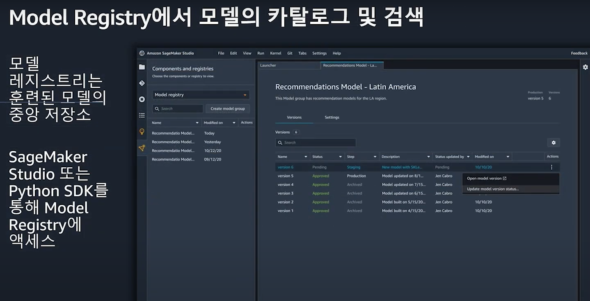

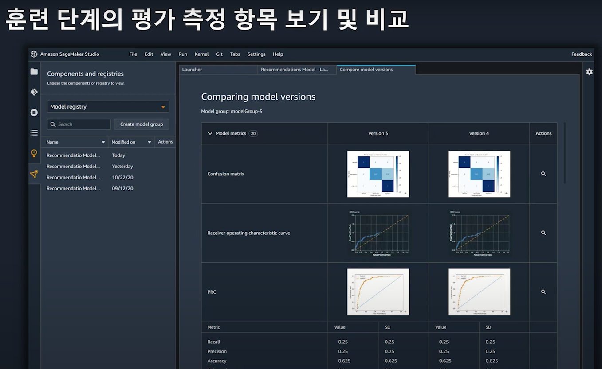

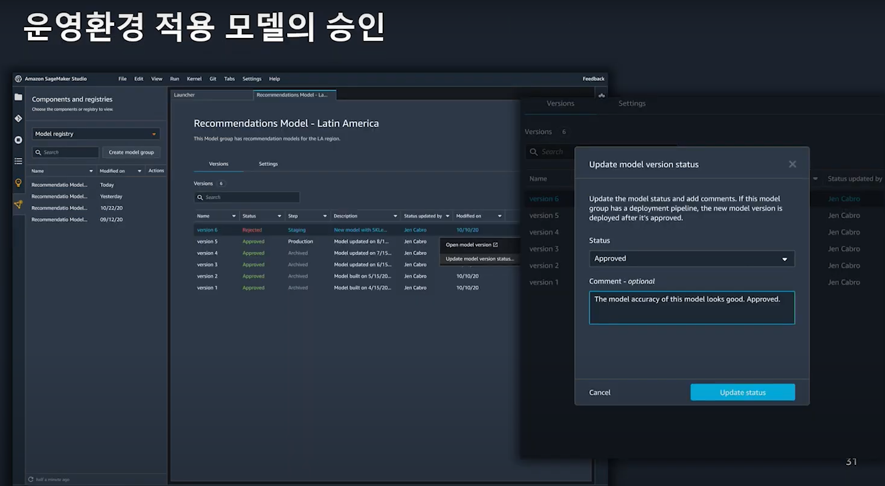

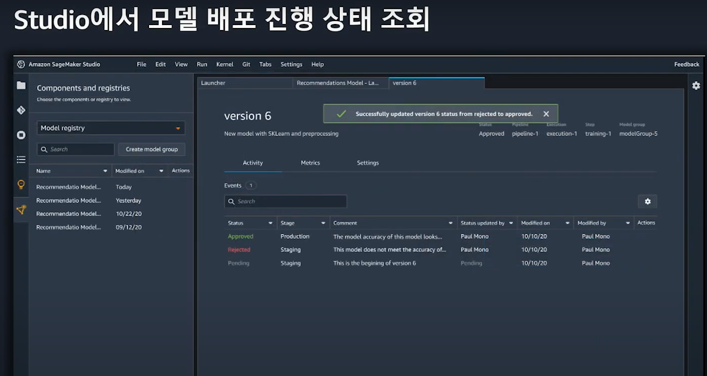

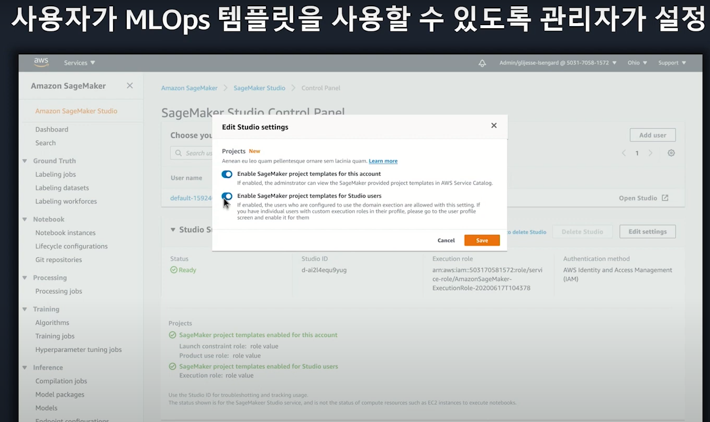

  
**Code Implementation of Pipeline**

https://sagemaker-examples.readthedocs.io/en/latest/sagemaker-pipelines/tabular/abalone_build_train_deploy/sagemaker-pipelines-preprocess-train-evaluate-batch-transform.html#SageMaker-Pipelines (code implementation)

https://www.youtube.com/watch?v=sj9wTbnfSW8,   https://github.com/gonsoomoon-ml/SageMaker-Pipelines-Step-By-Step/tree/main
(building pipeline with code)

https://github.com/gonsoomoon-ml/Self-Study-On-SageMaker/tree/main/MLOps
(농심 sagemaker architecture)
