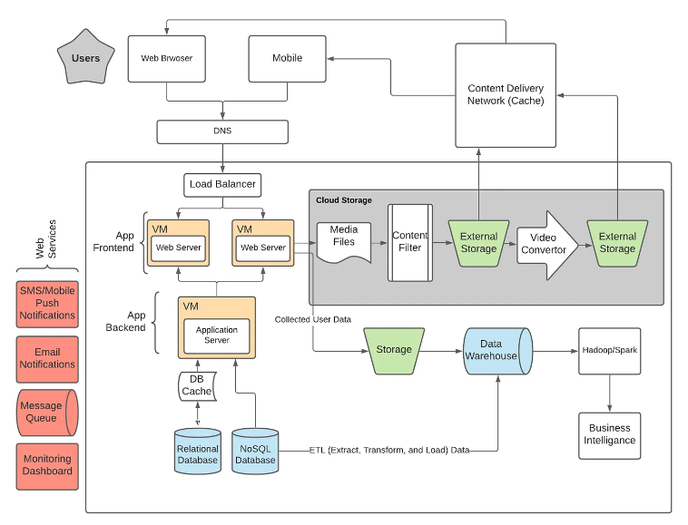
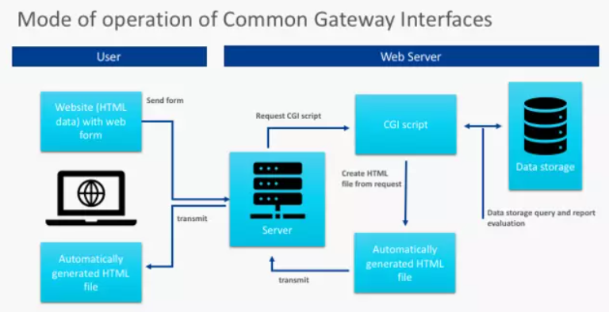
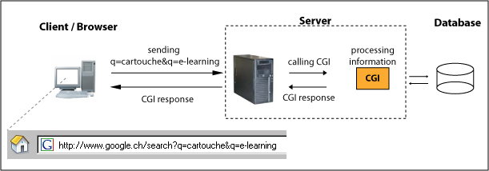
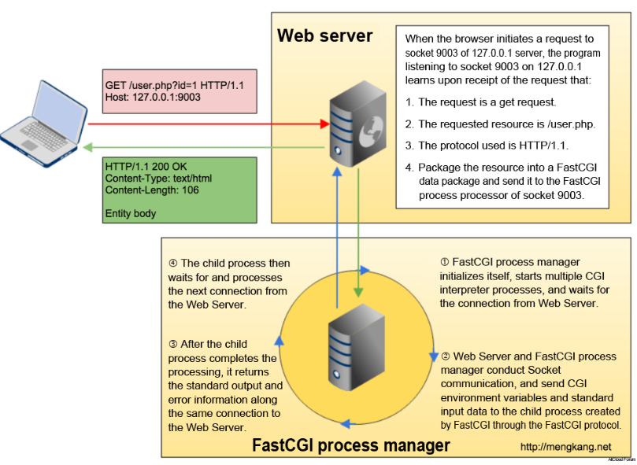
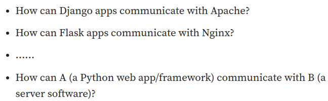

Web application server의 보통의 구조는 다음의 그림과 같다. 

- **Web server**: Apache or Nginx 같은 유명한 web server는 static content (HTML, image, video..)등을 보내주고 사용자가 수동으로 코딩을 할 필요 없이 configuration 파일을 수정해서 원하는 static file을 보내줄 수 있다. 다음은 nignx configuration file의 예시를 보여준다.
    
    ```python
    server {
        listen 80;
        server_name example.com;
        root /var/www/html;
    
        # Define settings for serving static files
        location / {
            try_files $uri $uri/ =404;
        }
    }
    ```
    <br />

- **CGI**: application server가 등장하기 전에는 dynamic content의 서빙을 위해서 CGI 프로그램을 이용했다. common gateway interface는 web server와 external application 사이를 연결 시켜주는 인터페이스이다. web server로 들어온 requests 중에 dynamic contents의 생성을 요구하는 것이 있다면 web server는 cgi를 통해서 external software에 접근하여 데이터를 받아오게 된다. cgi 스크립트는 python, perl, c++ 등 여러 언어로 작성될 수 있다.
    - 장점: dynamic website content를 간편한 방법으로 생성할 수 있다. 다양한 언어를 지원하다.
    - 단점: cgi는 request가 올 때마다 process를 하나씩 할당하기 때문에 메모리 낭비가 심하다. 또한 process의 실행과 종료를 반복해야 하기 때문에 트래픽이 몰리면 성능이 상당히 저하된다.

    <br />
    <br />   
- **FastCGI**: FastCGI는 CGI의 단점을 개선해 등장했다. 전통적인 CGI 방식은 HTTP 서버가 동적 프로그램을 만날 때마다 스크립트 파서를 다시 시작해 파싱을 수행하고 그 결과를 HTTP 서버에 반환해야 하기 때문에 성능이 좋지 못했다. FastCGI는 장기간 실행 가능한 CGI로 새로운 프로세스를 지속적으로 생성할 필요가 없다. 또한, FastCGI가 구성된 웹 서버는 FastCGI 프로세스 풀을 관리하여 들어오는 요청을 여러 프로세스로 분산한다. 이 풀은 트래픽 요구에 따라 확장 또는 축소될 수 있고, 이러한 확장성으로 상당한 양의 트래픽을 처리할 수 있다.
    <br />
    <br />   
- **Application server**: business logic을 처리하고, dynamic contents를 생성하고, database에 접근해 transaction을 처리하기도 한다. 또한, 사용하는 언어와 플랫폼에 따라 특화된 application server가 제공된다. 예를 들어, java EE application에 최적화된 runtime 환경을 제공하는 apache tomcat, wildfly, IBM websphere 등이 있다.
    <br />
    <br />   
- **그렇다면 FastCGI 와 Application Server의 차이점은?**
    - **실행**: FastCGI는 웹 서버와 별도의 프로세스로 실행되는 애플리케이션이다. 웹 서버는 FastCGI 프로세스를 생성하고 통신하여 동적 콘텐츠를 처리한다. 반면에, Application Server는 Application 전체 라이프사이클을 관리하며 비즈니스 로직, 데이터베이스 접근, 보안, 트랜잭션 관리 등을 처리하는 등 모든 측면을 다룬다.
    - **성능 및 확장성**: FastCGI는 장기간 실행되는 프로세스로서 프로세스 풀을 관리하고 확장해 대량 트래픽을 처리할 수 있다. Application server는 복잡한 로직을 처리하고 데이터베이스와의 상호 작용을 효율적으로 다루나 CGI와 비교하여 더 많은 리소스를 소비하며, 대규모 트래픽을 처리할 때 스케일링이 복잡할 수 있다. 그러나 apache tomcat과 같은 application server를 이용하면 보안, 확장성, 유지보수 관리 용이성, 오류 보고, 데이터베이스 연결 및 객체 지속성 등의 풍부한 환경을 제공하기 때문에, 직접 이 모든 기능을 구현해야하는 FastCGI 보다 더 좋은 선택일 수 있다.
    <br />
    <br />       


    <br />
    <br />   
        <br />
    <br />   
        <br />
    <br />   
        <br />
    <br />   
Apache나 Nginx 같은 웹서버는 클라이언트로부터 온 HTTP Request를 파싱해 응답을 생성하고, 정적, 동적 콘텐츠를 제공하는 역할을 한다. 각각의 웹서버는 다른 아키텍처를 가지고 있고 구성 및 설정이 다르다. 다양한 python web framework로 구현된 python application이 이런 각기 다른 web server에서 실행되기 위해서는 표준화된 인터페이스가 필요하다. 그래서 등장한 것이 **WSGI(web server gateway interface**이고 인터페이스를 사용하게 되면 python application과 web server 간의 결합도를 낮추고 호환성을 확보할 수 있다. 

- ### **WSGI**
    - wsgi는 application or app이라고 이름 붙여진 python function을 노출시켜 작동한다. 이 function은 2개의 인자를 받는데, 하나는 environ(현재 request의 정보와 web server의 환경변수에 대한 정보가 담긴 dictionary)고 다른 하나는 start_response(HTTP response를 돌려주기 위해 실행되는 function)이 있다. 보통 이 application function은 python framework like flask에 자동으로 구현이 되어있다.
    
    ```python
    def application(environ, start_response):
        start_response('200 OK', [('Content-Type', 'text/plain')])
        return [b'Greetings universe']
    ```
    
    - **WSGI frameworks의 종류**는 Bottle, Flask, Falcon, Django 등이 있고, **WSGI server**는 Gunicorn, uWSGI, Apache가 있다.
    
    - **단점**: 웹 서버의 발전으로 wsgi는 한계를 보이기 시작했다. wsgi는 공식적으로 웹 소켓을 처리할 수 있는 능력이 없고, http/2와도 작동할 수 없다. 또한 async나 await를 사용할 수 없다.
        
        wsgi는 한번에 하나의 request를 받고 response 해준다. 따라서, 애플리케이션을 비동기적으로 프로그래밍 했다고 하더라도 동기적인 호출 방식으로 동작하는 것이 큰 단점이다. 비동기적으로 구현하고 싶다면 multi-processing / threading을 구성해야 한다. single thread는 single request만 처리할 수 있기 때문이다. 진정한 비동기 처리를 하고 싶다면 ASGI를 사용하면 된다.
        

- ### **ASGI**
    - wsgi의 동기적 처리에 대한 문제를 해결하기 위해 등장한 것이 asgi이다. 이름도 Asynchronous server gateway interface이다. asgi 또한 application function을 정의하게 되는데 async function을 사용하고 3개의 인자를 받게 된다.
        
        scope는 현재 요청에 관한 정보를 포함한 dictionary이고, send는 application이 client로 메세지를 전송할 수 있게 해주는 비동기 호출 가능한 함수, receive는 application이 client로부터 메세지를 수신할 수 있게 해주는 비동기 호출 가능한 함수이다. 
        
        ```python
        async def application(scope, receive, send):
            event = await receive()
        		...
            await send({
                'type': 'http.response.body',
                'body': b'Hello, world!',
            })
        ```
        
    
    - receive and send는 비동기적으로 동작하기 때문에, multiple incoming events와 outgoing events를 허용할 수 있다. 이렇게 ASGI를 이용하게 되면 비동기 이벤트 루프를 사용하여 여러 I/O 작업을 병렬로 처리할 수 있고, 다중 스레드나 다중 프로세스를 활용하면 더 효율적인 처리가 가능하다.
    <br />   
    <br />   
    <br />   
    
reference(https://www.ionos.com/digitalguide/websites/web-development/what-is-a-cgi/, https://medium.com/techtofreedom/what-is-wsgi-a-readable-explanation-for-python-developers-e91beba35965)