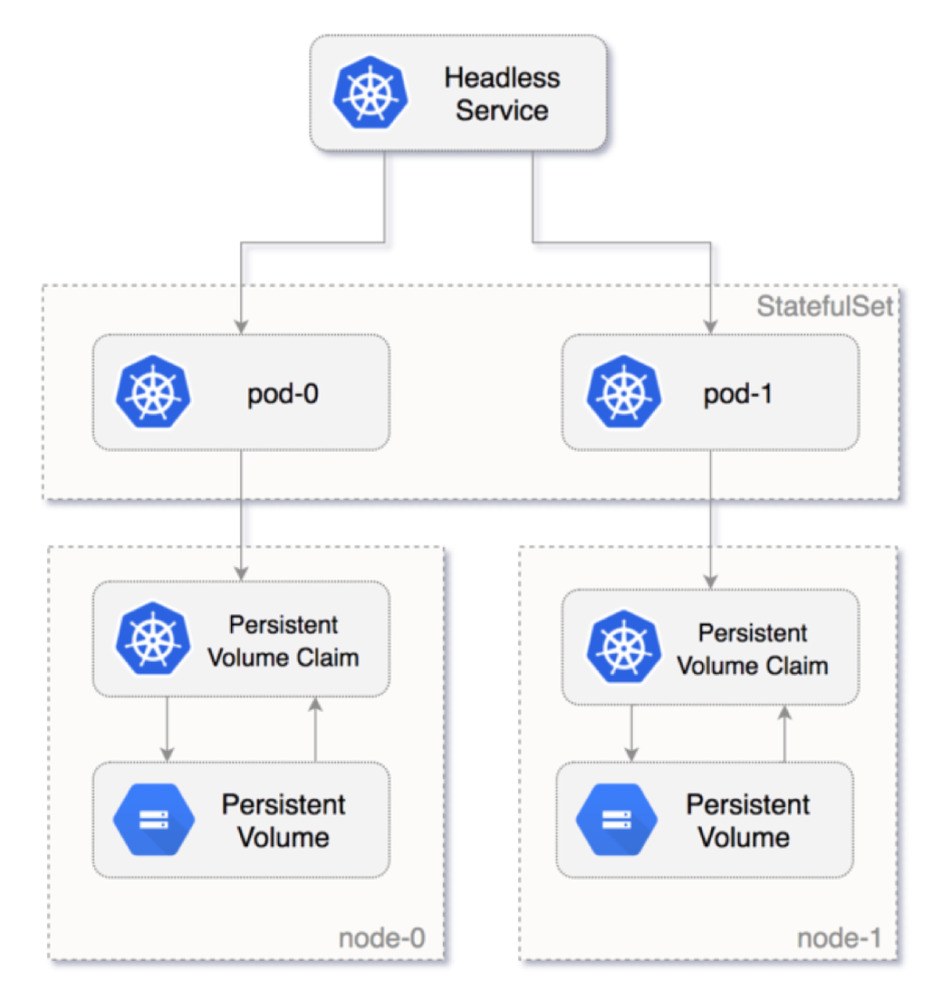

**Stateful Application 이란?**

Stateful Application은 데이터를 저장하고 유지하는 애플리케이션이다. MySQL, Oracle, PostgreSQL과 같은 모든 데이터베이스가 Stateful Application의 예시이다. 

반면에 Stateless Application은 데이터를 유지하지 않는다. 예를 들어, 여기에는 Node.js와 Nginx 등이 있다. Stateless Application은 각 요청마다 새로운 데이터를 받아 처리한다.   

웹 애플리케이션 구조에서 Stateless app은 사용자의 요청을 처리하기 위해 Stateful app과 연결된다. 

<br/>
<br/>

**StatefulSets 이란?** 

StatefulSet은 stateful application을 pod로 동작시키기 위한 쿠버네티스 controller다. StatefulSet을 사용하면 랜덤하게 각 pod에 id를 부여하는게 아니라, 0부터 시작하는 숫자를 각각 부여해서 각 pod를 구별지을 수 있다. ***즉, pod들의 순서와 고유성을 보장한다.***

새로운 pod는 이전 pod의 데이터를 복사해서 생성된다. 만약 이전 pod가 pending state라면 새로운 pod는 생성되지 않는다. 만약 pod를 삭제한다면, 가장 나중에 생성된 것부터 지워진다.  

다음의 이미지에서 statefulset pods 각각에 persistent volume이 연결되어 있는 것을 볼 수 있다. 
<br/>
<br/>


**StatefulSets의 특징**

1. MySQL 데이터베이스를 kubernetes에 배포했는데, replicas를 3개로 늘린다고 가정해보자. Frontend application은 MySQL 데이터베이스에 데이터를 read and write 해야하는 상황이다. 이럴 때, write는 첫번째 primary pod에서만 가능하게 하고, 다른 pods가 데이터를 복사해 가서 sync를 맞춘다. 그리고 read는 모든 pods에 요청할 수 있다. 이 과정을 statefulset을 이용해서 만들 수 있다. 
2. statefulset을 삭제 또는 스케일 다운해도 statefulset과 연관된 volume은 삭제되지 않는다. 예를 들어, MySQL Pod를 지우고 다시 시작하더라도 똑같은 volume의 데이터를 이용할 수 있다.  
<br/>
<br/>

<br/>
<br/>

**StatefulSet yaml 예시**
```python
apiVersion: apps/v1
kind: StatefulSet
metadata:
  name: mysql-set
spec:
  selector:
    matchLabels:
      app: mysql
  serviceName: "mysql"
  replicas: 3
  template:
    metadata:
      labels:
        app: mysql
    spec:
      terminationGracePeriodSeconds: 10
      containers:
      - name: mysql
        image: mysql:5.7
        ports:
        - containerPort: 3306
        volumeMounts:
        - name: mysql-store
          mountPath: /var/lib/mysql
        env:
          - name: MYSQL_ROOT_PASSWORD
            valueFrom:
              secretKeyRef:
                name: mysql-password
                key: MYSQL_ROOT_PASSWORD
  volumeClaimTemplates:
  - metadata:
      name: mysql-store
    spec:
      accessModes: ["ReadWriteOnce"]
      storageClassName: "linode-block-storage-retain"
      resources:
        requests:
          storage: 5Gi
```


<br/>
<br/>
reference: https://kubernetes.io/ko/docs/concepts/workloads/controllers/statefulset/, https://loft.sh/blog/kubernetes-statefulset-examples-and-best-practices/