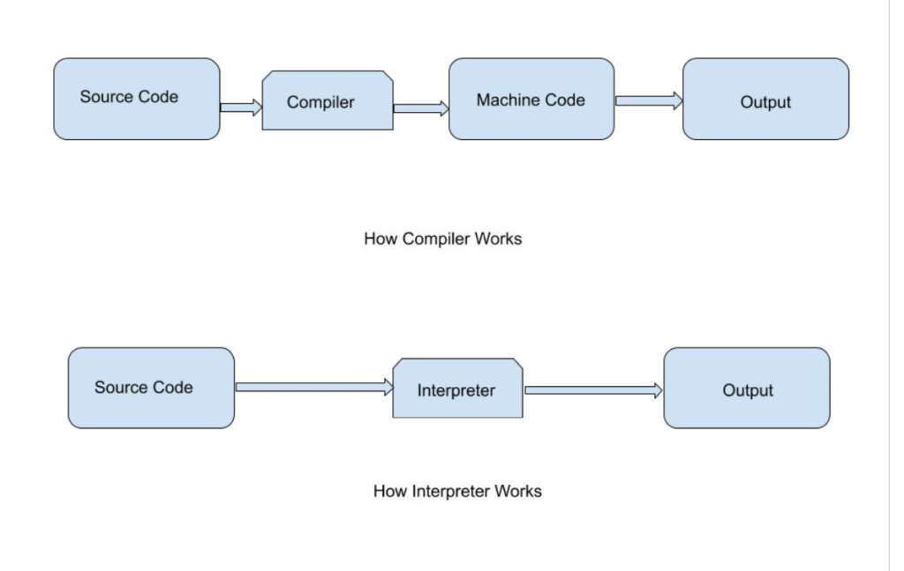
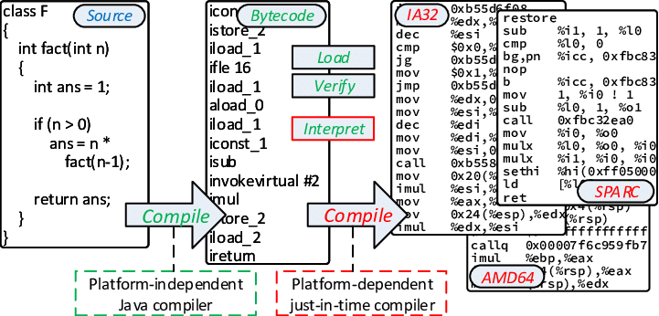
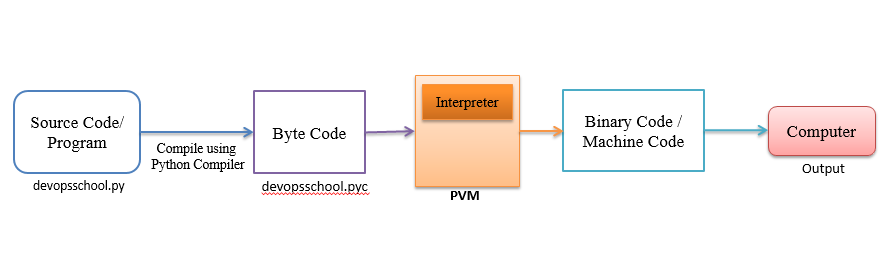

**CPython Interpreter는 인터프리터 이면서 컴파일러이다.** 일단, 컴파일러가 무엇이고 인터프리터가 무엇인지 알아보자. 

- **Compiler**: 사람이 해석 가능한 소스 코드를 컴퓨터가 실행 가능한 기계어로 번역해주는 프로그램이다. **전체 소스 코드를 한번에 통으로 해석하기 때문에 코드를 다시 수정하고 실행하려면 컴파일을 다시 해야하는 단점이 있다.** 대신에 한번에 모든 컴파일을 하기 때문에 실행 속도가 빠르다. 이러한 컴파일러는 크게 4가지 분류로 나뉜다.
    1. Static Compilation: 원시 코드를 바로 기계어로 변환하는 정적 컴파일
    2. Bytecode Compilation: 원시 코드를 바이트 코드로 변환하는 컴파일
    3. Ahead-Of-Time Compilation: 바이트 코드 등의 중간 코드를 기계어로 변환하는 AOT 컴파일
    4. Just-In-Time Compilation: 실행시 최초 한번에 한 해 컴파일을 거치는 JIT 컴파일
- **Interpreter**: 컴파일러와 대조적으로 **코드를 한 줄씩 읽으면서 기계어로 번역하는 프로그램이다. 실행 속도는 컴파일러를 사용하는 언어보다 느리지만 프로그램의 수정이 매우 간단하다는 장점이 있다.**
- **Machine Code**: Machine Code는 CPU의 연산 처리가 바로 가능한 바이너리 포맷으로 쓰여진 코드이다. 기계어는 각 운영 체제나 하드웨어에 종속적인 저수준의 코드이기 때문에, 한 플랫폼에서 만들어진 기계어 코드를 다른 플랫폼에서 그대로 실행할 수 없다.
- **Bytecode**: bytecode는 인간이 읽기는 어렵지만 기계는 이해하기 쉬운 저수준의 형태로 쓰여진다. Python 인터프리터는 bytecode를 각 운영 체제에 맞는 PVM (*PVM은 runtime engine으로 python system에 항상 내장되어 있고, python script를 실행하는 핵심 component이다) 에서 실행한다. PVM은 각 운영 체제에 맞게 구현되어 있어서, python 프로그램을 실행할 때마다 PVM이 bytecode를 읽어 해당 운영 체제의 기계어로 번역하여 실행한다. 이러한 과정 덕분에, python 코드는 어떠한 운영 체제에서도 동일한 결과를 얻을 수 있다. 개발자는 프로그램을 특정 운영 체제에 맞추어 다시 컴파일 할 필요 없이 한 번 작성한 python 코드를 다양한 운영 체제와 환경에서 실행할 수 있다. 따라서, python은 크로스 플랫폼 개발에 매우 유용하다는 장점이 있다.  
     

***CPython Interpreter는 c 언어로 작성되어 있고, .py의 파이썬 코드를 bytecode로 compile한 후 (이때, .pyc가 생성된다), Interpreter가 PVM(Python Virtual Machine)을 실행시켜 bytecode를 하나씩 순서대로 machine code로 변환하여 프로그램을 실행한다. 이렇게 함으로써 python은 디버깅하기 편리하고 플랫폼 독립적으로 실행될 수 있다.***