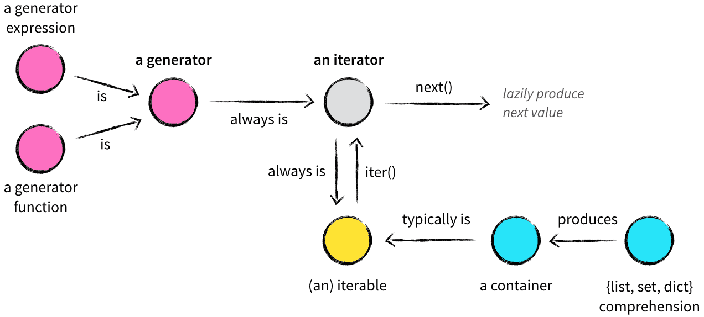

Iterators와 Generators가 무엇인지 알아보고, 둘의 차이점을 비교해 보자. (reference: https://www.datacamp.com/tutorial/python-iterators-generators-tutorial)
- - -
### **Iterables and Iterators**

- **Iterables**는 반복문을 사용하여 하나씩 요소를 순회하거나 반복할 수 있는 객체이다. List, Tuple, Set, Dictionary, String 같은 자료 구조가 이에 해당한다.
- **Iterator**는 순회할 수 있는 객체를 말한다. iterable 객체는 Iterator 객체가 될 수 있다. iterator를 만드려면 다음의 methods로 이루어져야 한다.
    1. __iter__(): convert an iterable to an iterator
    2. __next__(): return the next item in an iterator
    3. object의 내부 상태를 저장해야 한다.
    4. StopIteration exception (더이상 return 할 값이 없을 때)
- Iterable과 iterator를 더 제대로 이해하기 위해 예시를 들어보자. List를 생성해서, built-in function인 iter()를 불러 iterator를 생성해보자.
    
    ```python
    list_instance = [1, 2, 3, 4]
    print(iter(list_instance))
    
    """
    <list_iterator object at 0x7fd946309e90>
    """
    ```
    
    List 자체는 iterable이였으나 iterator는 아닌 상태였는데, iter() function을 부름으로써 iterator object로 변환할 수 있었다. 이를 입증하는 다음 예시를 살펴보자.
    
    ```python
    list_instance = [1, 2, 3, 4]
    print(next(list_instance))
    """
    --------------------------------------------------------------------
    TypeError                         Traceback (most recent call last)
    <ipython-input-2-0cb076ed2d65> in <module>()
        3 print(iter(list_instance))
        4
    ----> 5 print(next(list_instance))
    TypeError: 'list' object is not an iterator
    """
    ```
    
    위의 예시에서 iterator라면 포함하고 있을 next() function을 list 객채에서 불렀더니, list는 iterator가 아니라고 오류가 뜬다. 
    
- Iterator를 더 잘 이해하기 위해 예시를 계속 살펴보자. 다음은 위의 예시처럼 List 객체에 iter()를 적용해 next() function을 불러보았다.
    
    ```python
    # instantiate a list object
    list_instance = [1, 2, 3, 4]
    
    # convert the list to an iterator
    iterator = iter(list_instance)
    
    # return items one at a time
    print(next(iterator))
    print(next(iterator))
    print(next(iterator))
    print(next(iterator))
    """
    1
    2
    3
    4
    """
    ```
    
    python은 iterable 객체를 loop로 돌릴때 자동으로 iterator object를 생성해낸다. 다음은 그 예시이다. 
    
    ```python
    # instantiate a list object
    list_instance = [1, 2, 3, 4]
    
    # loop through the list
    for iterator in list_instance:
      print(iterator)
    """
    1
    2
    3
    4
    """
    ```
    
    StopIteration exception이 loop의 끝을 알려준다. 
    
- 같은 List 객체를 부르는 두 개의 iterator를 만들었다고 가정해보자. 각각의 iterator는 자신만의 진행 상태가 저장되어 있어서 서로 영향을 주지 않는다. 또한, Iterator는 lazy evaluation (call을 해야지만 생성되는 특성)한 특성을 가지고 있어, next() function으로 부르지 않는 이상 실행되지 않는다.
    
    ```python
    list_instance = [1, 2, 3, 4]
    iterator_a = iter(list_instance)
    iterator_b = iter(list_instance)
    print(f"A: {next(iterator_a)}")
    print(f"A: {next(iterator_a)}")
    print(f"A: {next(iterator_a)}")
    print(f"A: {next(iterator_a)}")
    print(f"B: {next(iterator_b)}")
    """
    A: 1
    A: 2
    A: 3
    A: 4
    B: 1
    """
    ```
    
- 자체적으로 iterator를 구현하는 것은 번거로운 과정이다. 따라서, 더 간편한 대안으로 Generator 객체를 사용할 수 있다.
- - -
### **Generators**

- generator는 ‘yield’ 키워드를 사용해 한 번에 한 값씩 반복 가능한 iterator를 반환하는 특수한 종류의 함수이다. 중요한 점은 일반적인 function과 달리 generator는 함수에서 생성되는 값들을 메모리에 저장하지 않는다. 다음은 그 예시를 보여준다.
    
    ```python
    def factors(n):
      factor_list = []
      for val in range(1, n+1):
          if n % val == 0:
              factor_list.append(val)
      return factor_list
    
    print(factors(20))
    """
    [1, 2, 4, 5, 10, 20]
    """
    ```
    
    위의 코드는 factors 함수에서 factor_list를 반환한다. 그렇다면 generator를 사용하면 어떻게 될까? 
    
    ```python
    def factors(n):
      for val in range(1, n+1):
          if n % val == 0:
              yield val
    print(factors(20))
    
    """
    <generator object factors at 0x7fd938271350>
    """
    ```
    
    factors 함수를 호출했을 때, 반환되는 것은 generator 객체이다. yield 호출 후에 factors 함수는 아직 종료된 상태가 아니다. 이제 반환된 generator 객체에 대해 next() 함수를 호출 할 때마다 한 번에 한 개씩 값을 print 해준다. 
    
    ```python
    def factors(n):
      for val in range(1, n+1):
          if n % val == 0:
              yield val
             
    factors_of_20 = factors(20)
    print(next(factors_of_20))
    
    """
    1
    """
    ```
    
    generator 객체를 만드는 또 다른 방법으로는 generator expressions가 있다. () rounded brackets을 이용해 generator를 만든다. 다음은 그 예시이다.
    
    ```python
    print((val for val in range(1, 20+1) if n % val == 0))
    """
    <generator object <genexpr> at 0x7fd940c31e50>
    """
    ```
