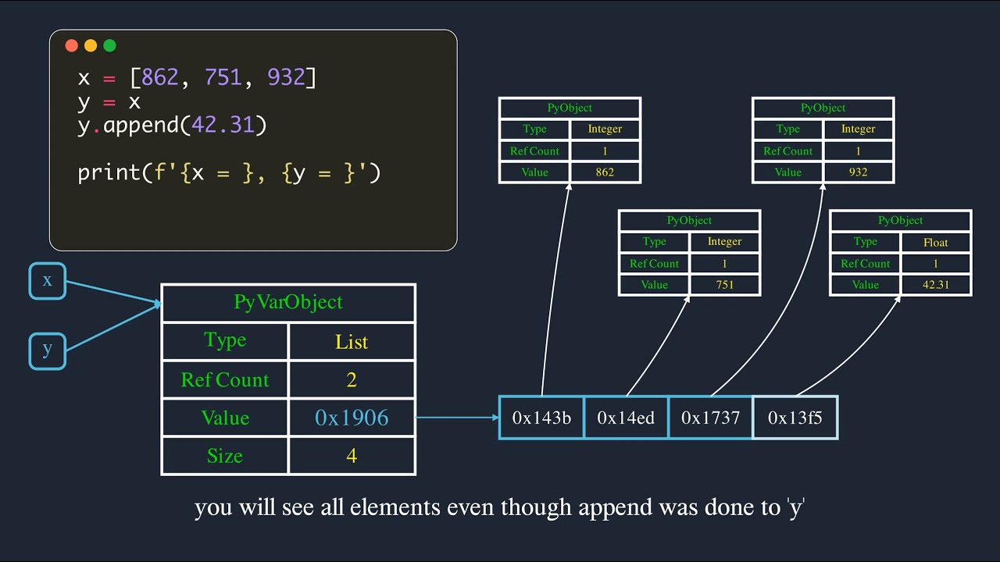

**Python Global Interpreter Lock == GIL은 하나의 process에서 하나의 thread만 python interpreter를 점유할 수 있게 하는 mutex이다. 즉, 오직 한 개의 thread만 실행 상태에 있을 수 있다는 의미이다. GIL은 multi threaded로 구성된 아키텍처에서 cpu-bound 처리에 대해 single thread로 동작하게 하여 병목 현상을 일으킨다.** 이게 무슨 의미인지 하나하나 파악해보자. (reference: https://realpython.com/python-gil/)
- - -

- **python의 object**: python은 pyobject or pyvarobject 등으로 표현되는 구조체에 실제 메모리에 저장된 값의 주소, type, reference count 등을 저장한다. reference count란 object가 참조된 횟수를 의미한다. reference count가 0이 되면 garbage collector가 메모리에 저장된 값을 release한다.

```python
import sys
a = 2
b = a
# 이 상황에서 2의 값을 가리키는 pyobject의 ref_count는 2이다. a와 b가 참조하고 있기 때문이다.
```
- - -
- **python이 GIL을 사용하는 이유는?** multi thread 환경에서 여러 threads가 이 reference count를 동시에 증가 or 감소 시키고 있다면 메모리에 저장된 값이 영원히 release되지 않는 메모리 누수 문제가 생기는 등 버그가 발생할 수 있다. 이것을 해결하기 위해 object에 lock을 걸어주는 방법을 생각해 볼 수 있다. 하지만, 이는 deadlock(교착상태: threads가 서로가 lock을 걸고 있는 자원에 접근하려고 무한 대기에 빠진 상태) 이라는 또다른 문제를 야기한다. GIL은 이런 문제들을 해결한다. 하나의 프로세스 안에서 하나의 thread가 python interpreter를 lock을 함으로써 python bytecode를 단독으로 실행할 수 있다.

- **GIL로 인한 문제:**
    - CPU-bound program: matrix multiplications, image processing 등의 cpu의 수학적 연산이 요구되는 프로그램
    - I/O-bound program: file, database, network 등의 input/output 처리를 위해 기다리는 시간이 긴 프로그램
    
    **GIL은 multi-thread 환경에서 CPU-bound program을 처리할 때 문제를 일으킨다.** 다음은 ****COUNT 변수를 파라미터로 하는 countdown 함수를 single thread로 처리하는 코드이다. 
    - - -
    ```python
    # single_threaded.py
    import time
    from threading import Thread
    
    COUNT = 50000000
    
    def countdown(n):
        while n>0:
            n -= 1
    
    start = time.time()
    countdown(COUNT)
    end = time.time()
    
    print('Time taken in seconds -', end - start)
    ```
    
    ```bash
    $ python single_threaded.py
    Time taken in seconds - 6.20024037361145
    ```
    - - -
    다음은 같은 코드를 multi thread로 구현한 코드이다.
    
    ```python
    # multi_threaded.py
    import time
    from threading import Thread
    
    COUNT = 50000000
    
    def countdown(n):
        while n>0:
            n -= 1
    
    t1 = Thread(target=countdown, args=(COUNT//2,))
    t2 = Thread(target=countdown, args=(COUNT//2,))
    
    start = time.time()
    t1.start()
    t2.start()
    t1.join()
    t2.join()
    end = time.time()
    
    print('Time taken in seconds -', end - start)
    ```
    
    ```bash
    $ python multi_threaded.py
    Time taken in seconds - 6.924342632293701
    ```
    - - -
    
    두 코드의 실행 시간을 비교해보면 multi-thread로 구성한 경우가 더 오랜 시간이 걸리는 것을 볼 수 있다. 이는 GIL이 multi-thread로 구성된 코드를 single-thread가 동작하는 것 처럼 하나의 thread가 python interpreter에 lock을 걸기 때문이다. 하지만, I/O bound program에는 thread들이 lock을 공유하기 때문에 문제가 되지 않는다. 예를 들어, 여러 threads들이 image의 부분 부분을 처리하는 경우의 CPU-Bound 프로그램의 경우에는 하나의 thread의 처리가 끝난 후에 다른 thread로 넘어가게 된다. 또한, lock을 할 때 발생하는 acquire and release 시간이 추가되어 오히려 single threaded로 동작되는 프로그램 보다 더 오랜 시간이 걸리게 되는 것이다. 
    
    **그렇다면 CPU-Bound와 I/O Bound가 동시에 존재하는 multi-threaded program에서는 어떻게 동작이 될까?** python은 thread가 점유한 GIL이 지정된 시간 후에 release 하도록 강제하고 있기 때문에, 다른 thread가 GIL을 acquire 하지 않는 이상 같은 thread가 계속 점유할 수 있다. 문제는 I/O bound thread가 GIL을 획득하기 전에 CPU bound thread가 지속적으로 재획득을 요청하기 때문에 I/O Bound thread가 GIL을 점유하기 힘들다. 이 때문에, python 3.2 부터는 GIL 요청을 기다리는 threads을 살피고 이들에게 기회를 주기 전에 동일한 thread가 GIL을 또 요청해 획득하는 것을 허락하지 않는 메커니즘을 추가했다. 
    

- **GIL로 인한 문제를 어떻게 해결 할 것인가?**
    - **Multi-Process**: 하나의 Process 당 하나의 Python Interpreter가 실행되기 때문에, Multi-Process 환경을 구성하면 GIL을 피할 수 있다. 그러나 Process마다 메모리가 할당되기 때문에 메모리 공간의 문제점이 생길 수 있다. 개인적인 생각으로는, 이 방법은 GIL에 대한 문제는 해결되지만 shared memory를 사용한다면 동기화 문제는 피할 수 없다고 생각한다. 따라서, 공유 자원이 필요없는 경우에 사용하면 좋을 것 같다. 다음은 multi process로 구성한 코드이다.
    - - -
    ```python
    from multiprocessing import Pool
    import time
    
    COUNT = 50000000
    def countdown(n):
        while n>0:
            n -= 1
    
    if __name__ == '__main__':
        pool = Pool(processes=2)
        start = time.time()
        r1 = pool.apply_async(countdown, [COUNT//2])
        r2 = pool.apply_async(countdown, [COUNT//2])
        pool.close()
        pool.join()
        end = time.time()
        print('Time taken in seconds -', end - start)
    ```
    
    ```bash
    $ python multiprocess.py
    Time taken in seconds - 4.060242414474487
    ```
    - - -
    - **다른 Python Interpreter 사용하기**: GIL을 사용하지 않는 Python Interpreter가 많다. PyPy, Jython 등의 다른 인터프리터를 고려해 볼 수 있을 것이다.