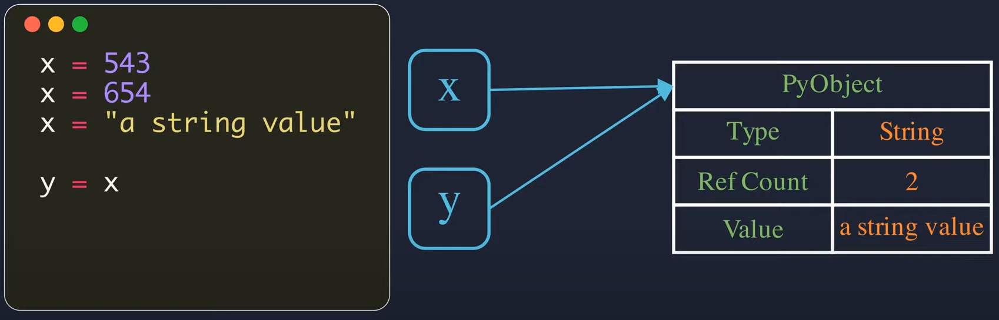
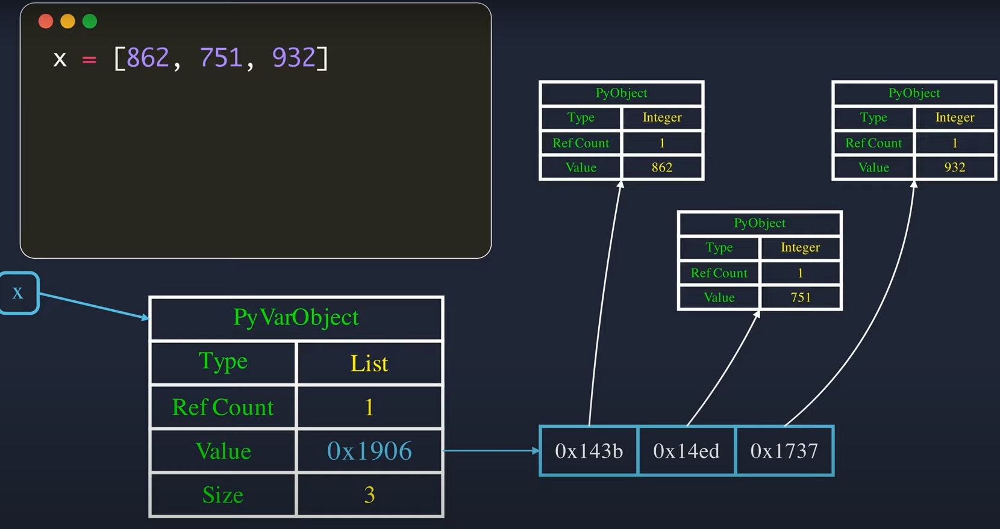
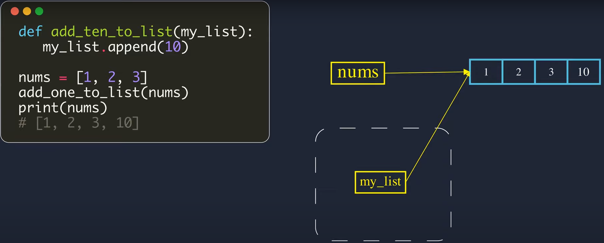

python은 모든 것을 object로 취급한다. b = 3 이라는 assignment를 보았을 때, b 라는 변수에 할당이 된 것은 메모리에 올라간 값 3이 아니라 그 메모리를 가리키는 주소 & reference count & data type의 정보가 저장된 pyobject이다. 아래의 그림을 살펴보면 더 확실히 이해할 수 있다. 
    <br />
    <br />  
만약 b = [1, 2, 3]의 리스트를 assign 했다면, 데이터 사이즈에 대한 정보가 추가된 pyvarobject를 b에 할당하게 된다. python의 리스트에 다양한 데이터 형을 추가할 수 있는 이유가 바로 여기에 있다.  
    <br />
    <br />   
    <br />
    <br />  
이제 주제로 돌아가보자. 함수에 전달받은 argument의 데이터 타입이 mutable or immutable 한지에 따라 call by value & call by assignment로 나눠진다. 일단 mutable data type에는 list, set, dictionary가 있고, immutable data type에는 int, float, str, tuple 등이 존재한다. 
 
먼저, **immutable한 객체가 인자로 전달 됐을 때, 이는 call by value 형식으로 동작한다**. 다음의 예시를 보자. 

```python
  def myfunc(a):
		a = 2

	b = 3
	myfunc(b)
```

b는 메모리에 올려진 값 3에 대한 정보가 저장된 pyobject를 가리키고 있다. 여기서 myfunc(b)를 전달하게 되면, myfunc(a)에서 a는 처음에는 같은 pyobject를 참조하게 된다. 이때, reference count는 2개가 된다. 그러나 myfunc 안에서 a = 2를 할당하게 되면, 새로운 값 2가 메모리에 올라가고 a는 이를 가리키는 pyobject를 참조하게 된다. 따라서, immutable한 int 형 데이터가 인자로 넘겨졌을 때, 함수내에서 그 인자에 변경을 가하면 전달 받았던 값과 상관없는 새로운 객체를 가리키게 되므로, call by value라고 할 수 있다. 
<br />
<br />

다음으로, **mutable한 객체가 인자로 전달 됐을 때, 이는 call by reference 형식으로 동작한다**. 다음의 예시를 보자. 

```python
def myfunc(a):
	a.append(3)

b = [1, 2]
myfunc(b)
```

b는 메모리에 올려진 리스트 값들을 가리키는 pyvarobject를 참조하고 있다. 이를 myfunc에 인자로 넘겨주면, myfunc(a)에서 a는 같은 pyvarobject를 참조하게 된다. 리스트는 mutable한 객체이므로 a.append로 리스트에 값을 추가하면, 새로운 리스트를 생성하는 것이 아니라 원래의 리스트가 변경된다. 따라서, 이를 call by reference라고 하는 것이다.