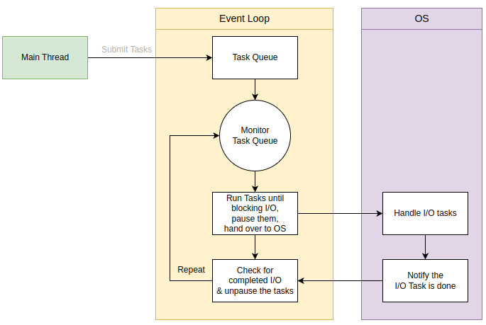

- ### **Async IO**
    
    asynchronous IO는 single process & single thread 환경에서 동시성으로 동작하는 것처럼 프로그래밍 하는 것이다. 이 방식으로 현재 동작에서 호출한 다른 동작의 처리가 완료되는 것을 기다렸다가, 끝난 후 본인의 동작을 다시 처리할 수 있다.  
    <br />

- ### **asyncio**
    
    asyncio는 coroutines을 실행하고 관리하기 위한 python package를 말한다. python 3.4 버전에서부터 소개되었던 이 package는 변화를 거듭해서 최신 버전의 coroutines으로는 async/await 문을 사용하여 구현한다. 
    <br />

- ### **Event Loop**
    
    asyncio package는 동시성 구현을 위해 event loop를 사용한다. 이 **event loop는 asyncio program의 핵심**이 되는데, 비동기 tasks와 callbacks을 실행하고, network IO를 처리하고, subprocess를 실행한다. 
    
    event loop의 동작을 이해하기 위해 예시를 살펴보자. 데이터를 파일에 작성하는 프로그램을 짠다고 생각했을 때, 다음과 같은 단계를 거치게 된다. 

    1. 파일 열기
    2. 데이터를 파일에 작성하고 완료될 때까지 기다리기
    3. 파일 닫기
    
    <br />
    흐름을 보았을 때, 2번째 작업은 블로킹이고 내부적으로는 다음과 같이 동작한다. 
    
    1. 파일에 데이터를 작성하는 함수가 데이터를 OS에 보내고
    2. OS가 데이터를 파일에 작성하고
    3. OS는 프로그램에게 파일 작성이 완료 되었다는 notification을 준다 (os마다 event notification system이 다른데, linux는 epoll, windows는 I/O completion port, macOS는 kqueue가 있다) 
    
    전체적인 흐름을 다음의 그림으로 살펴보자. main thread가 task들을 task queue에 쌓고, event loop가 지속적으로 task queue를 모니터링 한다. 그러다 I/O task를 발견하게 되면 task를 잠시 정지 시키고 os에게 넘겨주었다가, I/O task가 완료되면 os는 notification을 준다. 후에 정지됐었던 task를 다시 실행하게 된다. 이 프로세스는 task queue가 빌 때까지 계속 진행된다. 
     <br />   
    python 3.7 이전에는 event loop를 생성하고 tasks를 돌리는 일은 수동으로 작성해야 했었다. 3.7 이후에는 asyncio package가 event loop를 자동으로 처리해 주기 때문에 더이상 low-level api를 다룰 필요가 없어졌다. ayncio package에서 event loop를 어떻게 처리하는지 살펴보기 전에 먼저 async/await에 대해 알아보자.

    <br />
- ### **async/await**
    
    간단히 말해 async는 coroutine을 생성하고, await는 coroutine을 중단 시킬 수 있는 keywords이다. 
    
    다음의 예시는 coroutines이 적용되지 않은 경우이다.
    
    ```python
    def square(number: int) -> int:
        return number*number
    
    result = square(10)
    print(result)
    
    # output
    100
    ```
    
    이제 여기에 async keyword를 적용해 보겠다.
    
    ```python
    async def square(number: int) -> int:
        return number*number
    
    result = square(10)
    print(square)
    
    # output
    <coroutine object square at 0x00000185C31E7D80>
    sys:1: RuntimeWarning: coroutine 'square' was never awaited
    ```
    
    async를 적용했더니 result로 coroutine object가 반환이 되었고, square() 안에 await가 쓰이지 않아서 warning이 발생했다. 
    
    이 반환된 coroutine object를 실행시키려면 어떻게 해야할까? python 3.7 이전이라면 수동으로 event loop를 만들어 실행시키고 event loop를 닫고 하는 과정을 거쳐야 했지만, 지금은 asyncio package에서 asyncio.run()을 사용하면 자동으로 처리해준다. 다음 예시를 살펴보자. 
    
    ```python
    import asyncio
    
    async def square(number: int) -> int:
        return number*number
    
    result = asyncio.run(square(10))
    print(result)
    
    # output
    100
    ```
    
    coroutine 객체를 asyncio.run()으로 감싸줬더니 객체가 실행되서 100을 반환했다. **asyncio.run() 함수는 비동기 프로그램의 main entry point로 디자인 되었다는 점을 잘 알아두어야 한다.** 
    
    이제 await keyword를 적용해 보자. await는 coroutine의 실행을 중단 시키는 기능을 가지고 있다. 
    
    ```python
    import asyncio
    
    async def square(number: int) -> int:
        return number*number
    
    async def main() -> None:
        x = await square(10)
        print(f'x={x}')
    
        y = await square(5)
        print(f'y={y}')
    
        print(f'total={x+y}')
    
    if __name__ == '__main__':
        asyncio.run(main())
    
    # output
    x=100
    y=25
    total=125
    ```
    
    순차적으로 보면 __main__ 에서 main() 코루틴 함수를 실행하고 event loop를 관리한다. main()안에서 먼저 await문이 main()을 중단시키고 square(10)을 호출한다. 프로세스는 이런식으로 진행되는데 이 코드는 동기 프로그램 처럼 동작하므로 아직은 비동기적으로 구현됐다고 볼 수 없다. 위의 코드를 비동기적으로 실행하려면 asyncio.sleep()과 asyncio.create_task() 를 알아야 한다. 
    
- ### asyncio.sleep()
    
    이 function은 지정된 시간만큼 비동기 함수의 실행을 멈추고, 다른 task가 실행될 수 있게 한다. 일단, asyncio.create_task()를 작성하지 않고 sleep()만 쓰면 어떻게 작동되는지 예시를 살펴보자.
    
    ```python
    import asyncio
    import time
    
    async def call_api(message, result=1000, delay=3):
        print(message)
        await asyncio.sleep(delay)
        return result
    
    async def main():
        start = time.perf_counter()
    
        price = await call_api('Get stock price of GOOG...', 300)
        print(price)
    
        price = await call_api('Get stock price of APPL...', 400)
        print(price)
    
        end = time.perf_counter()
        print(f'It took {round(end-start,0)} second(s) to complete.')
    
    asyncio.run(main())
    
    # output
    Get stock price of GOOG...
    300
    Get stock price of APPL...
    400
    It took 6.0 second(s) to complete.
    ```
    
    이 예시에서 코루틴 함수를 호출했지만, event loop의 task로서 할당하지는 않았었다. 따라서, 이 코드는 동시성을 이루지 못했다. 여러 task들에 동시성을 부여하려면 task를 만들어야 한다. 
    
- ### asyncio.create_task()
    
    하나의 task는 코루틴을 감싸며 (wrapper), 해당 코루틴이 가능한 빨리 이벤트 루프에서 실행 되도록 예약한다. 여러 개의 작업을 생성하고 이를 동시에 이벤트 루프에서 즉시 실행되도록 예약할 수 있다는 점이 중요하다. task를 만들려면 asyncio.create_task() 함수를 이용할 수 있다. 
    
    이제 위의 코드에서 task를 만들어, 비동기 프로그래밍을 완성해보자. 
    
    ```python
    import asyncio
    import time
    
    async def call_api(message, result=1000, delay=3):
        print(message)
        await asyncio.sleep(delay)
        return result
    
    async def main():
        start = time.perf_counter()
    
        task_1 = asyncio.create_task(
            call_api('Get stock price of GOOG...', 300)
        )
    
        task_2 = asyncio.create_task(
            call_api('Get stock price of APPL...', 300)
        )
    
        price = await task_1
        print(price)
    
        price = await task_2
        print(price)
    
        end = time.perf_counter()
        print(f'It took {round(end-start,0)} second(s) to complete.')
    
    asyncio.run(main())
    
    # output
    Get stock price of GOOG...
    Get stock price of APPL...
    300
    300
    It took 3.0 second(s) to complete.
    ```
    
    create_task()를 하면 스케줄링과 동시에 event loop에 바로 올리게 된다. 이 task를 await로 호출하고, asyncio.sleep()이 호출되면 event loop에 올려져있는 다음 task를 바로 실행하게 된다. 다음은 위 코드의 실행 과정을 보여준다. 
    
     이제 기능이 다른 task가 추가 되었을 때 동작하는 것도 살펴보자. 
    
    ```python
    import asyncio
    import time
    
    async def call_api(message, result=1000, delay=3):
        print(message)
        await asyncio.sleep(delay)
        return result
    
    async def show_message():
        for _ in range(3):
            await asyncio.sleep(1)
            print('API call is in progress...')
    
    async def main():
        start = time.perf_counter()
    
        message_task = asyncio.create_task(
            show_message()
        )
    
        task_1 = asyncio.create_task(
            call_api('Get stock price of GOOG...', 300)
        )
    
        task_2 = asyncio.create_task(
            call_api('Get stock price of APPL...', 300)
        )
    
        price = await task_1
        print(price)
    
        price = await task_2
        print(price)
    
        await message_task
    
        end = time.perf_counter()
        print(f'It took {round(end-start,0)} second(s) to complete.')
    
    asyncio.run(main())
    
    # output
    Get stock price of GOOG...
    Get stock price of APPL...
    API call is in progress...
    API call is in progress...
    API call is in progress...
    300
    300
    ```
    
- ### asyncio.gather()
    
    여러 비동기 tasks들을 실행하고 그 결과를 작업이 완료되면 받아보고 싶을 수 있다. 이를 위해 gather() 함수를 사용할 수 있다. 
    
    ```python
    gather(*aws, return_exceptions=False) -> Future[tuple[()]]
    ```
    
    - aws: awaitable objects 들의 sequence를 말한다. gather 함수는 자동으로 해당 작업들을 스케줄링 한다.
    - return_exceptions: 예외가 발생하면 즉시 대기하는 작업으로 전달이 되고, 기다리고 있는 다른 tasks들은 계속 실행된다.
    
    이제 예시를 살펴보자. 
    
    ```python
    import asyncio
    
    class APIError(Exception):
        def __init__(self, message):
            self._message = message
    
        def __str__(self):
            return self._message
    
    async def call_api(message, result, delay=3):
        print(message)
        await asyncio.sleep(delay)
        return result
    
    async def call_api_failed():
        await asyncio.sleep(1)
        raise APIError('API failed')
    
    async def main():
        a, b, c = await asyncio.gather(
            call_api('Calling API 1 ...', 100, 1),
            call_api('Calling API 2 ...', 200, 2),
            call_api_failed(),
            return_exceptions=True
        )
        print(a, b, c)
    
    asyncio.run(main())
    
    # output 
    Calling API 1 ...
    Calling API 2 ...
    100 200 API failed
    ```