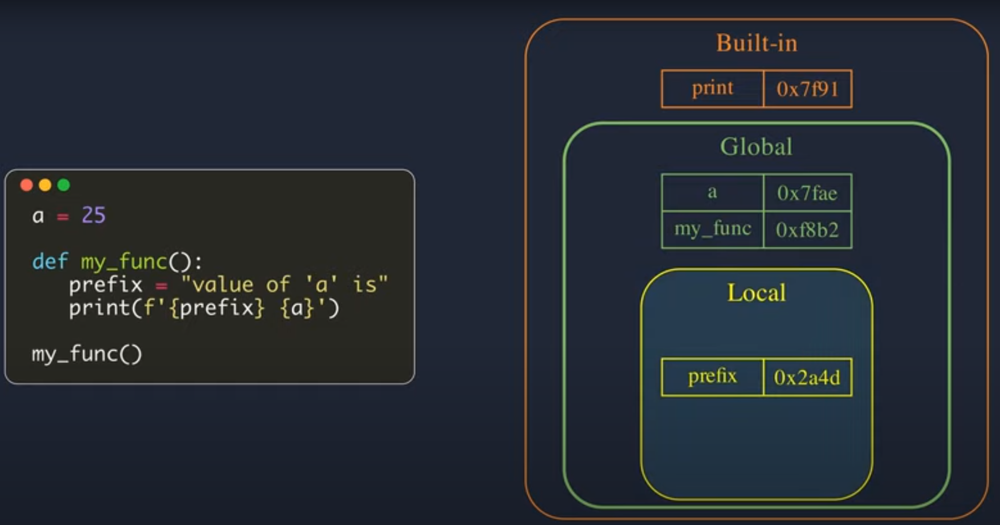
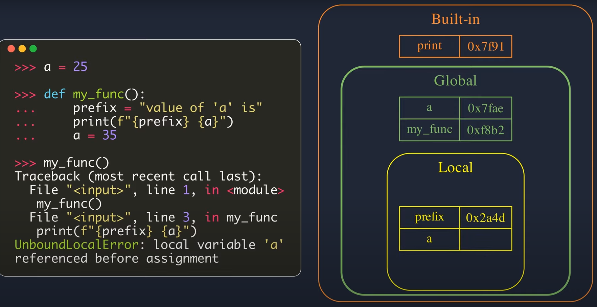
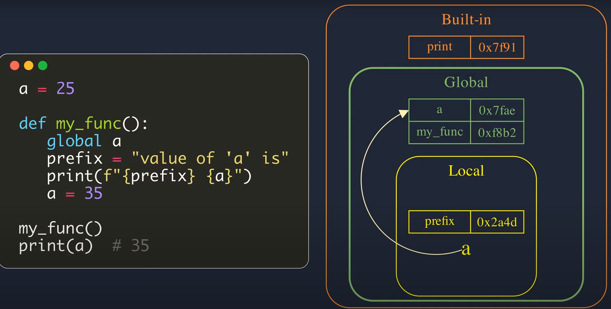
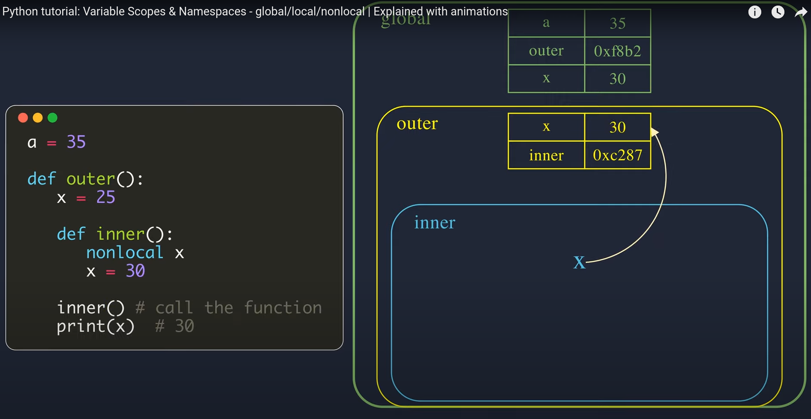

python은 함수, 변수 등 모든 것이 object로 선언이 되고, assignment statement는 이런 object를 참조하는 symbolic name을 만든다. x = 2에서 x가 바로 symbolic name이라고 할 수 있다. 그렇다면, 수 많은 objects들이 존재할텐데 이들의 symbolic name이 함수 내에 있는지 밖에 있는지 어떻게 구분을 할 수 있을까? 바로 namespace가 이를 구분하는데 쓰인다. namespace는 현재 정의된 symbolic names과 이들이 참조하는 objects에 관한 정보의 collection이다. 
    <br />
    <br />   
- - -
### **Namespaces**

**namespaces**는 3가지로 구분된다. 

1. Built-in
2. Global
3. Local
    <br />
    <br />   
- **Built-in namespaces**
    
    built-in namespaces는 모든 python built-in objects들의 name을 포함하고 있고, 이들은 python이 작동하는 한 어디에서든 쓰일 수 있다. 대표적으로 print(), max(), len() 등이 있다. 다음의 코드로 built-in namespaces에 존재하는 objects 리스트들을 볼 수 있다. 
    
    ```python
    >>> dir(__builtins__)
    ['ArithmeticError', 'AssertionError', 'AttributeError',
     'BaseException','BlockingIOError', 'BrokenPipeError', 'BufferError',
     'BytesWarning', 'ChildProcessError', 'ConnectionAbortedError',
     'ConnectionError', 'ConnectionRefusedError', 'ConnectionResetError',
     'DeprecationWarning', 'EOFError', 'Ellipsis', 'EnvironmentError',
     'Exception', 'False', 'FileExistsError', 'FileNotFoundError',
     'FloatingPointError', 'FutureWarning', 'GeneratorExit', 'IOError',
     'ImportError', 'ImportWarning', 'IndentationError', 'IndexError',
     'InterruptedError', 'IsADirectoryError', 'KeyError', 'KeyboardInterrupt',
     'LookupError', 'MemoryError', 'ModuleNotFoundError', 'NameError', 'None',
     'NotADirectoryError', 'NotImplemented', 'NotImplementedError', 'OSError',
     'OverflowError', 'PendingDeprecationWarning', 'PermissionError',
     'ProcessLookupError', 'RecursionError', 'ReferenceError', 'ResourceWarning',
     'RuntimeError', 'RuntimeWarning', 'StopAsyncIteration', 'StopIteration',
     'SyntaxError', 'SyntaxWarning', 'SystemError', 'SystemExit', 'TabError',
     'TimeoutError', 'True', 'TypeError', 'UnboundLocalError',
     'UnicodeDecodeError', 'UnicodeEncodeError', 'UnicodeError',
     'UnicodeTranslateError', 'UnicodeWarning', 'UserWarning', 'ValueError',
     'Warning', 'ZeroDivisionError', '_', '__build_class__', '__debug__',
     '__doc__', '__import__', '__loader__', '__name__', '__package__',
     '__spec__', 'abs', 'all', 'any', 'ascii', 'bin', 'bool', 'bytearray',
     'bytes', 'callable', 'chr', 'classmethod', 'compile', 'complex',
     'copyright', 'credits', 'delattr', 'dict', 'dir', 'divmod', 'enumerate',
     'eval', 'exec', 'exit', 'filter', 'float', 'format', 'frozenset',
     'getattr', 'globals', 'hasattr', 'hash', 'help', 'hex', 'id', 'input',
     'int', 'isinstance', 'issubclass', 'iter', 'len', 'license', 'list',
     'locals', 'map', 'max', 'memoryview', 'min', 'next', 'object', 'oct',
     'open', 'ord', 'pow', 'print', 'property', 'quit', 'range', 'repr',
     'reversed', 'round', 'set', 'setattr', 'slice', 'sorted', 'staticmethod',
     'str', 'sum', 'super', 'tuple', 'type', 'vars', 'zip']
    ```
    
- **Global namespaces**
    
    module 단위로 사용 가능한 objects의 name을 포함한다. 인터프리터는 프로그램이 import 문을 사용하여 로드하는 모든 모듈에 대해 global namespaces를 생성한다. 
    <br />     
- **Local  namespaces**
    
    함수 내 objects의 name을 저장하는 공간이다. 
    
    <br />     
다음의 이미지를 보면 이 namespaces들을 확실히 구분할 수 있을 것이다.     <br />
    <br />      <br />
    <br />  


### **Scope**

여러 개의 네임스페이스가 존재한다는 것은 프로그램이 실행되는 동안 특정 name이 여러 다른 네임스페이스에 동시에 존재할 수 있다는 것을 의미한다. 그렇다면 python에서는 어떻게 동일한 name을 구별할 수 있을까? 답은 scope에 있다. 스코프는 name이 의미를 가지는 프로그램의 영역이다. interpreter는 name 정의가 발생하는 위치와 코드에서 name이 참조되는 위치를 기반으로 runtime 중에 이를 결정한다. 

name의 scope를 찾을 때 내부에서부터 외부로 뻗어나가기 때문에 local → global → built-in 순으로 찾아나선다.

다음의 예시를 보면, print(f”{prefix} {a}”)에서 지역 변수 a가 assignment 전에 참조되었다는 에러가 뜬다. 처음 compile을 진행할 때는 local namespace에 a라는 symbolic name이 아직 assignment 되지 않은 상태이기 때문에 값이 빈채로 local namespace에 존재한다. global namespace에도 a가 존재하고 있지만, scope는 내부에서 외부로 찾아나가기 때문에 먼저 local에 존재하는 a를 참조하게 된다. a의 assignment는 print() 뒤에서 일어나기 때문에 지역변수 a가 아직 assignment 전에 참조 되었다는 에러가 뜨는 것이다.     <br />      <br />
    <br />  

### **global**

위의 코드에서 본래 의도했던 바는, global namespace에 존재하는 a를 함수 내에서 참조하고 싶었던 것이다. global 키워드는 이를 해결해준다. name a가 global namespace에 존재한다고 가리켜줌으로써 함수 내에서 a를 참조할 수 있었다.    <br />      <br />
    <br />  

### **nonlocal**

enclosed 함수에서 enclosing 함수에 있는 객체를 수정하고 싶다면 nonlocal을 쓰는 것이 바람직하다. 바로 다음 예제를 보면 바로 이해가 될 것이다. inner() 함수 내에서 outer() 함수 내의 x 객체를 수정하기 위해 nonlocal 키워드를 사용해 수정을 가할 수 있다. nonlocal은 내부에서 외부로 차례대로 뻗어나가면서 해당 객체를 찾아나간다. 

reference:https://www.youtube.com/watch?v=WYZrLtFNDVI