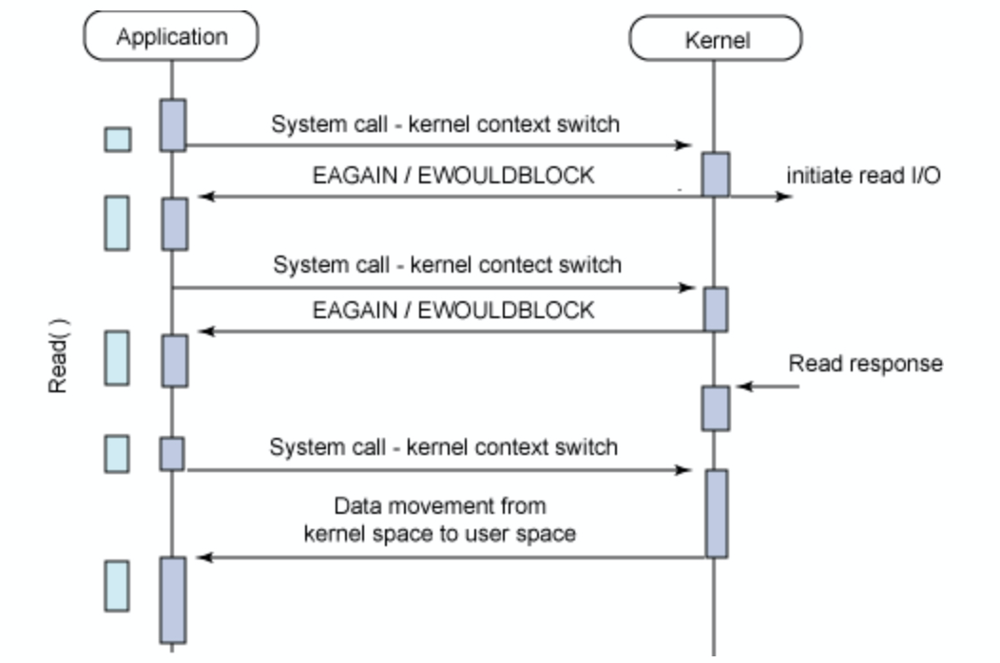

- **동기:** 요청한 작업에 대한 완료를 한 후에 작업이 순차적으로 처리되는 방법

- **비동기:** 요청한 작업에 대한 완료 여부와 상관 없이 자신의 작업을 계속 처리하는 방법
- **블록킹:** cpu 제어권을 요청한 작업에 넘겨줘서, 처리가 완료된 후 제어권을 넘겨받고 자신의 작업을 처리하는 방법
- **논-블록킹:** 요청한 작업을 처음 실행시킬 때만 제어권을 넘겨줬다가 금방 다시 돌려받고, 본인의 작업을 동시에 처리해 나가는 방법
- - -
- **동기 + 블록킹** = 요청한 작업의 결과 값을 돌려받을 때까지 기다렸다가 처리가 완료되면 자신의 작업도 처리하는 방법, I/O 처리의 경우, system call 마다 thread를 생성하기 때문에 I/O 요청이 많은 서비스에서는 작업당 한번의 context switching이 발생하게 된다. 이는 성능을 떨어뜨리게 되고, block이 되어있는 동안 kernel의 응답을 계속해서 기다리기 때문에 cpu를 사용하지 못해 자원을 효율적으로 사용할 수 없다. **ex) 코드를 실행 후 커멘드에서 입력받는 경우**
- - -
- **동기 + 논-블록킹** = cpu 제어권을 넘겨주지 않았기 때문에 본인의 작업을 계속 처리하되, 요청한 작업의 결과를 지속적으로 확인하면서 작업을 수행한다. 결국에는 return 되는 값을 이용해서 자신의 작업을 처리하게 된다. I/O 프로세스의 경우 커널로부터 결과를 반환 받기까지 계속 상태를 체크해야 하기 때문에 context switching이 자주 일어나고, 결과를 반환 받기까지 계속 체크하는 busy-wait 상태가 된다. 또한 loop 내에 polling 주기도 적절히 설정하지 않으면 커널에게 의미없는 요청이 빈번히 갈 수 있기 때문에 오히려 작업의 지연을 초래할 수 있다.  **ex) 게임에서 다른 맵으로 이동할 때, 화면에 얼만큼 맵 데이터가 다운로드 되었는지 띄워주는 방법. 다운로드는 계속 진행되고 있고, 화면에는 얼마나 로딩됐는지 계속 체크하면서 계속 프로그래스 바를 띄워준다.**
- - -
- **비동기 + 논-블록킹** = cpu 제어권을 넘겨주지도 않고, 요청한 작업의 결과가 돌아오든 아니든 상관이 없기 때문에 본인의 작업을 계속 수행해 나간다. 호출한 작업이 완료되면 작업 완료 시그널을 보내거나 콜백을 보낸다.  **ex) 웹 브라우저의 파일 다운로드 할 때를 예로 들 수 있다. 웹 브라우저는 웹 사이트에서 파일을 다운로드 할 때, 파일의 전송이 완료될 때까지 다른 작업을 하지 않고 기다리는 것이 아니라, 다른 탭이나 창을 열거나 웹 서핑을 할 수 있다. 이는 웹 브라우저가 파일 다운로드를 비동기적으로 처리하고, 콜백 함수를 통해 다운로드가 완료되면 알려주는 방식으로 구현되어 있기 때문**
- - -
- **비동기가 중요한 이유는 I/O 같은 느린 작업이 발생했을 때, 기다리지 않고 다른 작업을 처리하면서 동시에 처리하여 멀티 작업을 할 수 있기 때문**이다. 예를 들어, 웹 애플리케이션에서 데이터베이스 쿼리를 수행하는 작업이 있다고 가정했을때, 동기적이라면 데이터베이스에서 응답이 올 때까지 기다려야 한다. 그러면 대규모 트래픽이 발생했을 때 웹 애플리케이션의 성능이 저하될 수 있다.